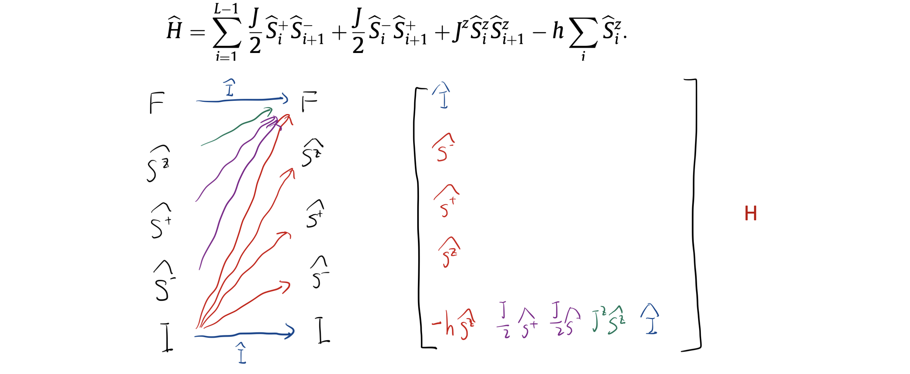
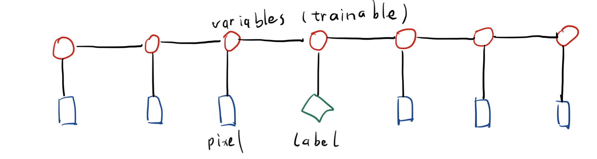
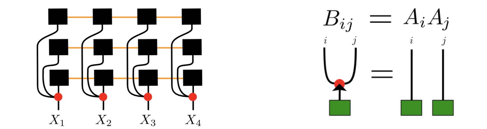
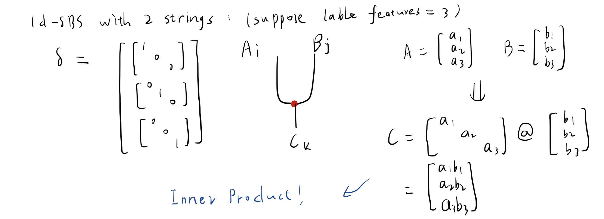

# TNModel
Tensor Network models including `MPS`, `1d-SBS` and `CNN-PEPS` for classification with `PyTorch` or `TensorFlow 2` backend and optimizing MPO for Heisenberg XXZ model and 1d-Ising model with Density Matrix Renormalization Group (DMRG). We implement the tensor network algorithms with [Google's tensornetwork](https://github.com/google/TensorNetwork.git).

  

  

 

(Green - Finished, Yellow - With Some Problems, Red - Not Finished)

## Notes
Examples are in the root folder. They use `PyTorch` and `TensorFlow` as backends respectively.

For ground state solving with `DMRG`, you need to calculate the corresponding MPO (Matrix Product Operators) for target Hamiltonian. Here is an example:

In MPS for image classification, the pixels and labels are input to the MPS like this:

As for 1d-SBS, the structure is like this:

where the red nodes are "Copy Tensors". The dangling edges of 1d-SBS which denote the output are the inner product of the strings:

The structure of PEPS comes from [Supervised Learning with Projected Entangled Pair States](https://arxiv.org/abs/2009.09932):

## Installation
- You can choose to use `PyTorch` or `TensorFlow 2` as backend.
- Install `tensornetwork>=0.4.4`, `numpy` and `tqdm`.
- Clone this repo.

## Notice
__This is a very early version and it is unstable.__

## Reference
- [TensorNetwork for Machine Learning](https://arxiv.org/abs/1906.06329)
- [From Probabilistic Graphical Models to Generalized Tensor Networks for Supervised Learning](https://arxiv.org/abs/1806.05964)
- [Supervised Learning with Projected Entangled Pair States](https://arxiv.org/abs/2009.09932)
